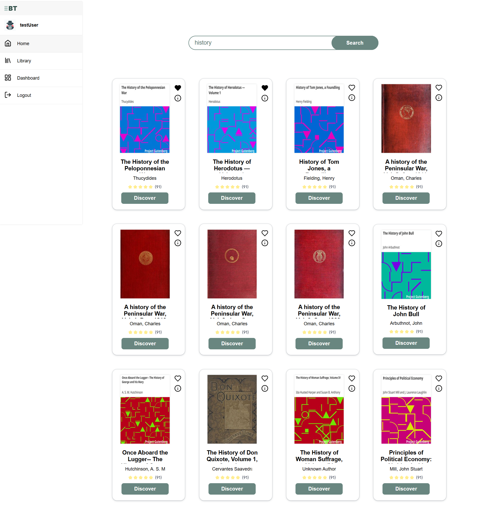
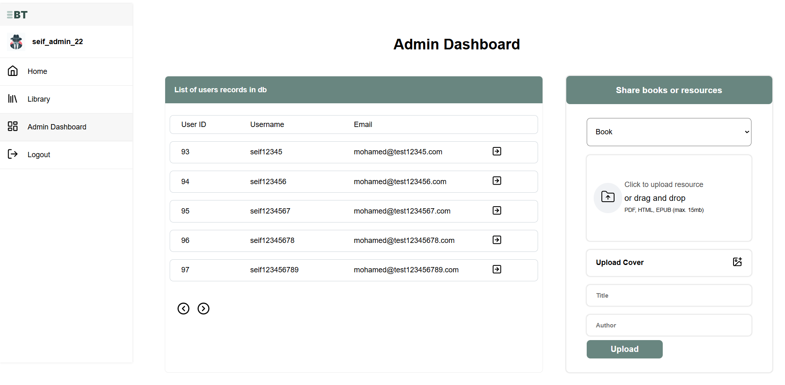
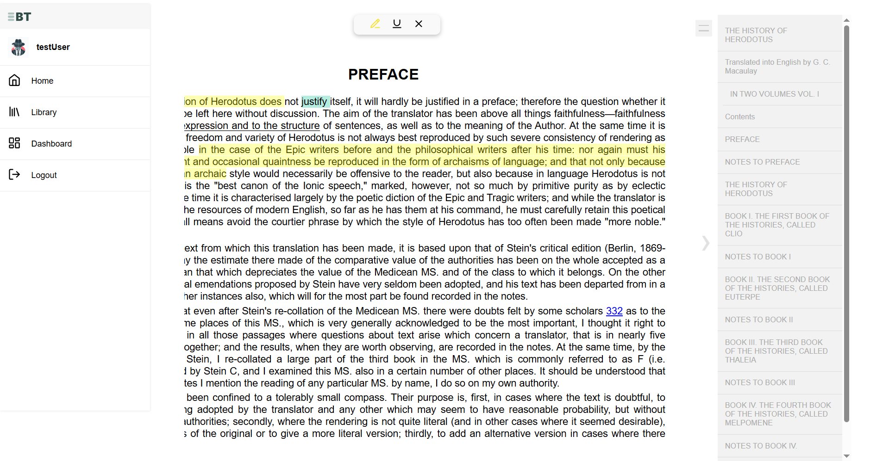

# 📚 Booktracked

**Booktracked** is a full-stack web application designed to digitize, organize, and enhance access to public domain books and educational resources. It provides an intelligent platform for users to search, read, annotate, and even contribute their own works to the digital archive.

---

## 📌 Project description

Booktracked addresses the need for a better and more interactive way to access royalty-free or public domain books. With the aid of modern technologies and user-centered design, this project transforms book discovery and reading into a seamless experience.

- Built as a **Single Page Application (SPA)** using the **MERN** stack pattern.
- Follows **MVC (Model-View-Controller)** architecture.
- Modular and component-based front-end using **React**.
- RESTful API-driven backend using **Node.js** & **Express**.
- Relational database design and management via **MySQL + phpMyAdmin**.
- Designed and prototyped in **Figma** with UI/UX best practices.

- **Search & Read Public Domain Books**
- **Highlight, Annotate, and Save Quotes**
- **User-Contributed Uploads (Books, Research, Slides)**
- **Full Dashboard for Admin and Users**
- **Online Reading with EPUB Support**

---

## 🧠 Key Features

- **Advanced Search API**  
  Search public domain books from major providers like [Gutenberg](https://www.gutenberg.org/), [Open Library](https://openlibrary.org/), and more.

- **Download or Link to External Resources**  
  Users can either download or access external links for book resources.

- **Text Highlighting & Bookmarks**  
  Highlight sentences or paragraphs and save them as cards with personal notes.

- **Quotes and Personal Notes**  
  Save and browse memorable quotes or annotated sections.

- **User Uploads**  
  Share your own content (books, research, etc.) under a public domain license.

- **User Authentication & Roles**  
  Register, sign in/out, and manage profiles securely.

- **Admin Dashboard**  
  Full control panel for managing users, books, and contributions.

---

## 🖼️ Screenshots



---



---



---

| Page         | Description                               |
| ------------ | ----------------------------------------- |
| Home Page    | Search books, browse genres               |
| Reading Page | Read online with highlight/comment tools  |
| Dashboard    | Manage uploaded resources & reading lists |
| Library      | Saved books, notes, summaries             |

> ⚠️ Live version not deployed yet – coming soon!

---

## Installing

1. Download and install Node.js
2. Clone this repo
3. Install project dependencies sever and and client each has separate folders and `package.json`
4. Install Xampp or any MySQL server and run the database
5. Navigate to client to run react and server to run node

---

## 📡 API Structure

The base API URL is: http://localhost:3000/api

**Folder Structure**

- **`server/index.js`** – Main entry point for API route setup.
- **`controller/`** – Contains API logic for each route.
- **`router/`** – Defines routes and applies middlewares.
- Each route has its **own file** to handle specific API requests.

**Example Route Definition**

```js
const { protect } = require("../middleware/searchMiddleWare");
const { search } = require("../controller/searchController");

router.get("/", protect, search);

module.exports = router;
```

---

## Tech Stack

**Client:** React.js, react-reader, react-epub-viewer, usehooks-ts  
**Server:** Node.js, Express.js, REST APIs  
**Database:** MySQL (via phpMyAdmin)

---

## 📄 License

This project is built for educational purposes. Content uploaded by users must be under a public domain or free-to-use license.

---

## Project Motivation

- To Start working with react.js and facing challenging situation and handling complex UI/UX.

- Getting starting with node.js and expresses as a server side development solution

- To create REST API's using node.js which is challenging.

- DBMS with MySQL, and node.js querying options with SQL

- Discovering public codebases from github to integrate in my project

- To understand how some library works underwood like react-reader

---

## Future Enhancements

- [ ] Implement full EPUB.js reader
- [ ] AI-powered personalized reading suggestions and book summarization
- [ ] Tailwind.css instead of native CSS
- [ ] Integrating UI library like Shadcn
- [ ] State management library like Redux
- [ ] React-Query for fetching
- [ ] React Hook Form to handle forms
- [ ] Enhancing authentication with auth library like Auth0
- [ ] Add dark mode
