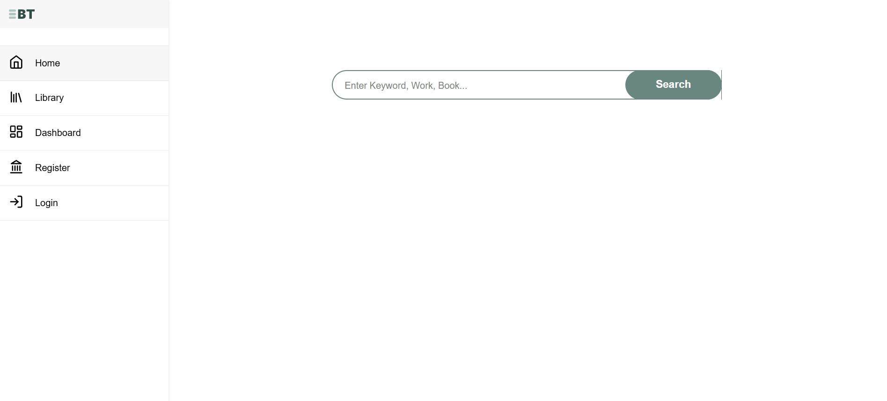
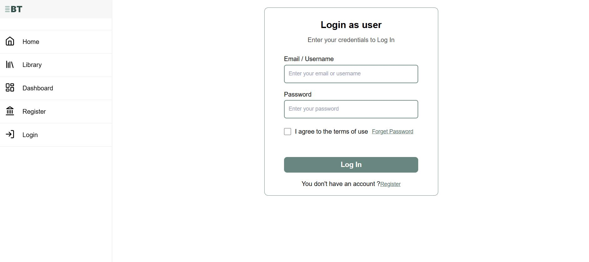
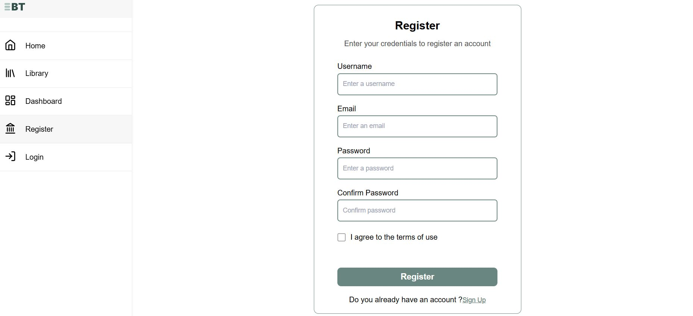
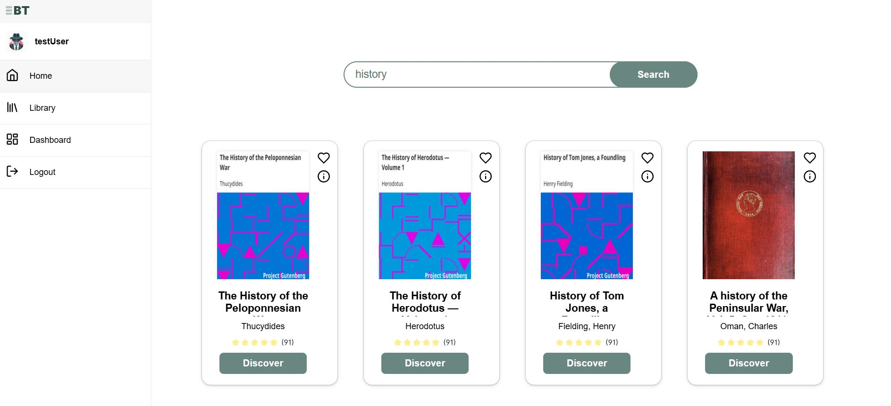
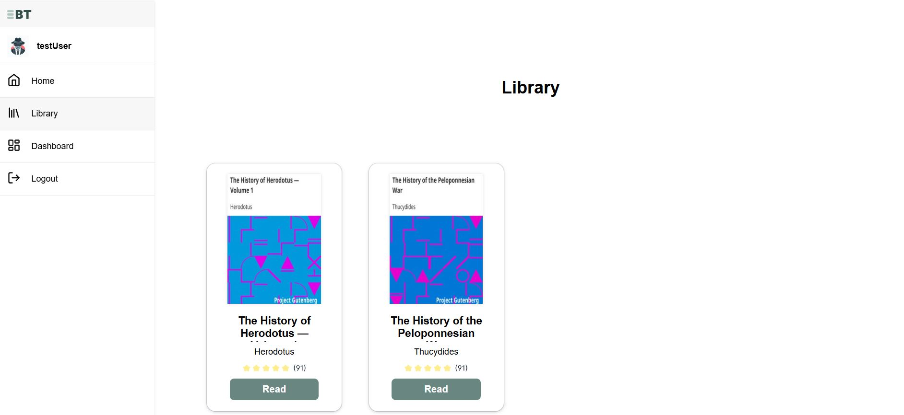
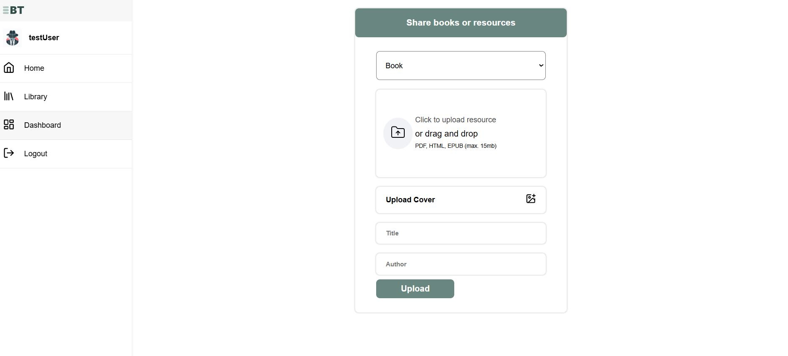
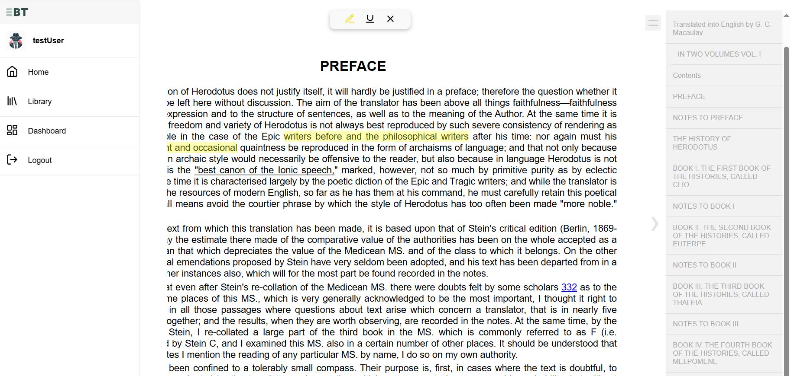

# 📚 Booktracked

**Booktracked** is a full-stack web application designed to digitize, organize, and enhance access to public domain books and educational resources. It provides an intelligent platform for users to search, read, annotate, and even contribute their own works to the digital archive.

---

## 📌 Project Overview

Booktracked addresses the need for a better and more interactive way to access royalty-free or public domain books. With the aid of modern technologies and user-centered design, this project transforms book discovery and reading into a seamless experience. 

- **Search & Read Public Domain Books**
- **Highlight, Annotate, and Save Quotes**
- **User-Contributed Uploads (Books, Research, Slides)**
- **Full Dashboard for Admin and Users**
- **Online Reading with EPUB Support**

---

## 🧠 Key Features

- 🔍 **Advanced Search API**  
  Search public domain books from major providers like [Gutenberg](https://www.gutenberg.org/), [Open Library](https://openlibrary.org/), and more.

- 📥 **Download or Link to External Resources**  
  Users can either download or access external links for book resources.

- 🖍️ **Text Highlighting & Bookmarks**  
  Highlight sentences or paragraphs and save them as cards with personal notes.

- 💬 **Quotes and Personal Notes**  
  Save and browse memorable quotes or annotated sections.

- 📤 **User Uploads**  
  Share your own content (books, research, etc.) under a public domain license.

- 🔒 **User Authentication & Roles**  
  Register, sign in/out, and manage profiles securely.

- 📊 **Admin Dashboard**  
  Full control panel for managing users, books, and contributions.

---

## 🖼️ Screenshots & Demo
 

| Page               | Description                                  |
|--------------------|----------------------------------------------|
| Home Page          | Search books, browse genres, featured works |
| Book Page          | View book details, metadata, author info    |
| Reading Page       | Read online with highlight/comment tools    |
| Dashboard          | Manage uploaded resources & reading lists   |
| User Lists         | Saved books, notes, summaries               |

> ⚠️ Live version not deployed yet – coming soon!

---

## 🛠️ Tech Stack

### Front-End:
- React.js
- react-reader
- usehooks-ts
- react-epub-viewer

### Back-End:
- Node.js
- Express.js
- REST APIs

### Database:
- MySQL (via phpMyAdmin)

### Dev Tools:
- Visual Studio Code
- Jest & React Testing Library
- Nodemon

## 🧪 Architecture & Methodology

- Built as a **Single Page Application (SPA)** using the **MERN** stack pattern.
- Follows **MVC (Model-View-Controller)** architecture.
- Modular and component-based front-end using **React**.
- RESTful API-driven backend using **Node.js** & **Express**.
- Relational database design and management via **MySQL + phpMyAdmin**.
- Designed and prototyped in **Figma** with UI/UX best practices.

---

## 🗓️ Project Timeline (Work Plan)

| Phase                    | Duration       |
|--------------------------|----------------|
| UI/UX & Architecture     | Weeks 1–4      |
| Front-End Development    | Weeks 5–9      |
| Back-End Development     | Weeks 10–12    |
| Database Integration     | Weeks 13–14    |

---
## 📄 License

This project is built for educational purposes. Content uploaded by users must be under a public domain or free-to-use license.

---

## What I learned

- Starting to work with react.js and toggling challenging situation and handling complex UI/UX.

- Getting starting with node.js and expresses as a server side development solution

- To create REST API's using node.js which is challenging.

- DBMS with MySQL, and node.js querying options with SQL

- Discovering public codebases from github to integrate in my project

- Understanding how some library works underwood like react-reader

- Made me think that there are bottlenecks and limits to such projects and I need to think about scalability, and some technologies are not good for bigger project, EX: I didn't think about performance optimization and state management, when I started but at the end of the project that was a must and the project now 
of course need to be improved. and point is I know how to do so

## ✨ Future Enhancements

- Add dark mode
- Implement full EPUB.js reader
- AI-powered personalized reading suggestions and book summarization
- Tailwind.css instead of native CSS
- Integrating UI library like Shadcn
- State management library like Redux
- React-Query for fetching 
- React Hook Form to handle forms
- Enhancing authentication with auth library like Auth0

## Finally 

I could of figure out those spaces for enhancements by developing, searching, analyzing, and documenting. This project helped me to think about real world development solutions and what I should learn to level up my skills for the next project and to be read for the job market 

